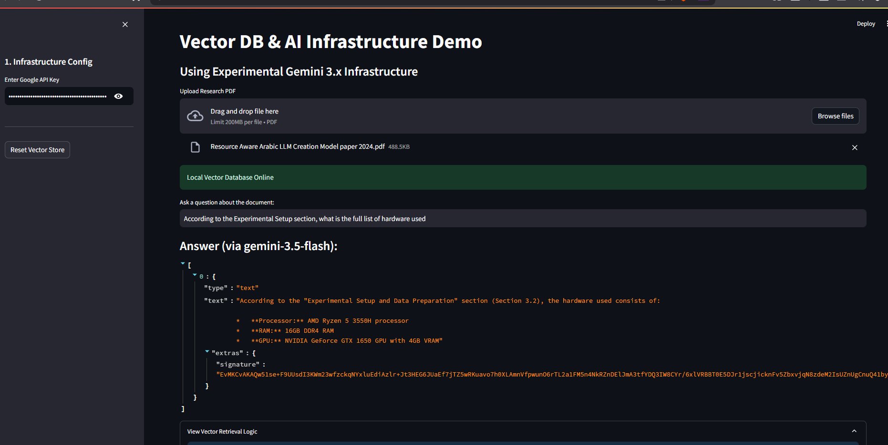
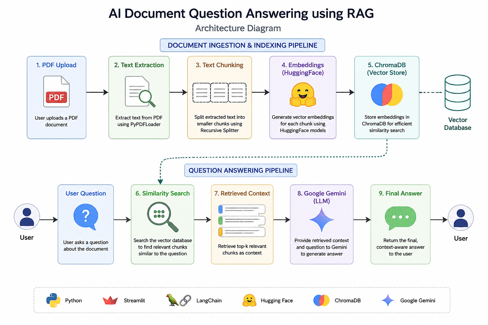

# AI Document Question Answering using RAG

## Overview

AI-powered PDF Question Answering application built using LangChain, ChromaDB, HuggingFace Embeddings, and Google Gemini.

Users can upload PDF documents and ask natural language questions. The system retrieves relevant document chunks and generates context-aware answers using Retrieval-Augmented Generation (RAG).

---

## Application Preview

### Main Interface , Example Question & Answer



### Vector Retrieval Logic


---

## Architecture



---

## Features

- Upload PDF documents
- Extract text automatically
- Semantic search
- ChromaDB vector storage
- HuggingFace embeddings
- Google Gemini integration
- Context-aware answers
- Streamlit interface

---

## Tech Stack

| Component | Technology |
|------------|------------|
| Frontend | Streamlit |
| LLM | Gemini |
| Framework | LangChain |
| Vector DB | ChromaDB |
| Embeddings | HuggingFace |
| Language | Python |

---

## Installation

### Clone Repository

```bash
git clone https://github.com/HabibaOsama1/AI-Document-QA-RAG.git
cd AI-Document-QA-RAG
